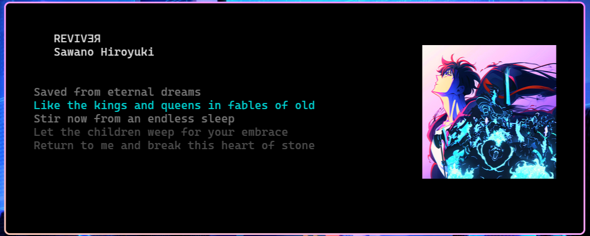

# 🎤 Karaoke CLI

Um **player de letras sincronizadas** para terminal com integração ao **Spotify via `playerctl`**, renderização de capas com **Kitty + icat**, e visual totalmente configurável (cores, tamanho de fontes, posições, etc).  

<p align="center">
  
</p>

---

## 🚀 Recursos

- 🎶 Sincronização de letras `.lrc` em tempo real  
- 🖼️ Renderização da capa do álbum diretamente no terminal (`kitty +kitten icat`)  
- 🎨 Sistema de cores com suporte a:
  - ANSI padrão (ex: `red`, `bright_cyan`)
  - Paletas modernas (`tokyo_`, `dracula_`, `nord_`, `onedark_`)
  - Cores HEX (`#RRGGBB`)
- 📁 Busca automática de letras (`LRCLib` via script Python)
- 🧩 Layout completamente configurável
- 🕹️ Controles automáticos de fonte (via `kitty @ set-font-size`)
- 🌘 Efeito “fade” para letras anteriores/próximas
  
---

## ⚙️ Dependências

- **C++17 ou superior**
- **Kitty terminal**
- **playerctl**
- **Python 3** (para baixar letras)
- **wget** ou **curl**

No Arch Linux:
```bash
sudo pacman -S playerctl python wget kitty
```

---

## 🧭 Execução
Clone o repo
```bash
git clone https://github.com/Nerver-zip/karaoke-cli
```

Compile
```bash
cd karaoke-cli
make
```

Entre no diretório do binário e rode:
```bash
cd ~/Desktop/dev/karaoke-cli/bin
./karaoke
```

Ou crie um alias permanente no `.bashrc` / `.zshrc`:
```bash
alias karaoke='cd ~/Desktop/dev/karaoke-cli/bin && ./karaoke'
source ~/.zshrc ou source ~/.bashrc se usar Bash  
```
Assim você pode fazer `karaoke` a partir de qualquer lugar do seu sistema.

---

## 🧩 Configuração (`config/config.ini`)
Customize como quiser esse arquivo para atender as suas preferências.

---

## 🐱 Configuração do Kitty

- Para habilitar o controle de fonte pelo arquivo config.ini, ative o controle remoto do Kitty adicionando a seguinte linha:
  ```
  allow_remote_control yes
  ```
  em `~/.config/kitty/kitty.conf`

---

## 🧠 Funcionamento Interno

1. Detecta a música atual via `playerctl`.
2. Busca e exibe a capa (`icat` via Kitty).
3. Localiza ou baixa o arquivo `.lrc`.
4. Exibe as letras sincronizadas com o tempo.
5. Atualiza dinamicamente a linha atual.

---

## 🎨 Paleta de Cores Disponível

**Padrão ANSI:**
```
black, red, green, yellow, blue, magenta, cyan, white,
bright_black, bright_red, bright_green, bright_yellow,
bright_blue, bright_magenta, bright_cyan, bright_white
```

**Tokyo Night:**
```
tokyo_yellow, tokyo_blue, tokyo_cyan, tokyo_magenta,
tokyo_green, tokyo_red, tokyo_fg, tokyo_comment, tokyo_bg
```

**Dracula:**
```
dracula_bg, dracula_fg, dracula_purple, dracula_pink,
dracula_cyan, dracula_green, dracula_orange,
dracula_red, dracula_yellow
```

**Nord:**
```
nord_blue, nord_cyan, nord_green, nord_yellow,
nord_orange, nord_red, nord_purple, nord_fg, nord_bg
```

**OneDark:**
```
onedark_blue, onedark_green, onedark_cyan,
onedark_red, onedark_yellow, onedark_purple,
onedark_fg, onedark_bg
```

**HEX direto:**
```
#rrggbb
Exemplo: title_color = #E0AF68
```
---

## 🐧 Licença

MIT License — use, modifique e compartilhe livremente.
